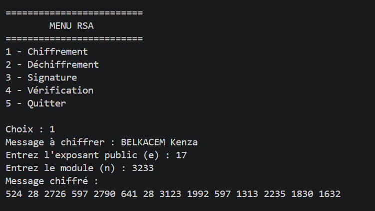
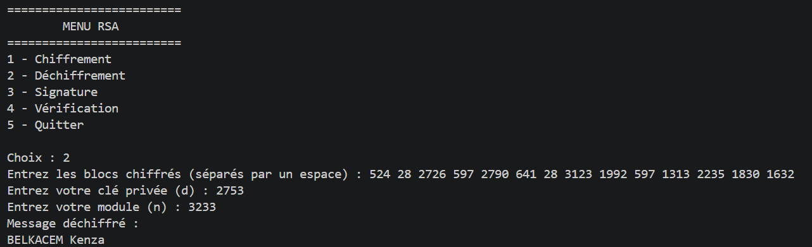
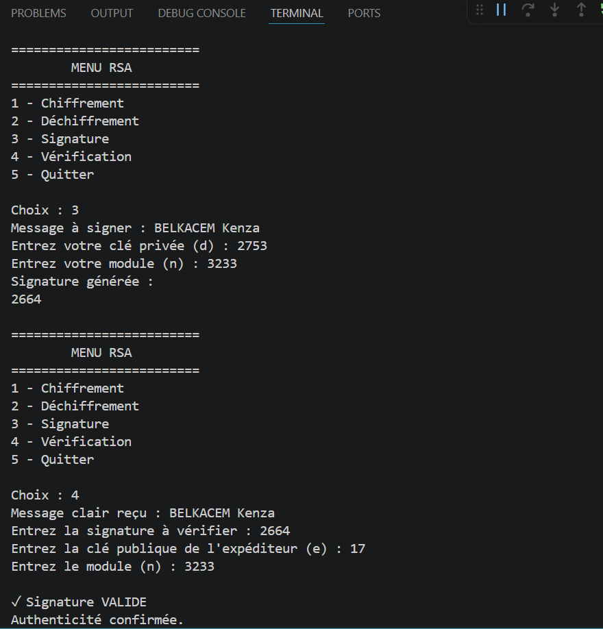

#  Cryptographie RSA en Python

Une implémentation simple et pédagogique du cryptosystème **RSA** développée en **Python**.

Ce projet permet de découvrir les principes fondamentaux de la cryptographie asymétrique à travers une application en ligne de commande offrant les fonctionnalités de chiffrement, de déchiffrement, de signature numérique et de vérification de signature.

---

##  Description

Le chiffrement RSA est l'un des algorithmes de cryptographie à clé publique les plus utilisés pour assurer la confidentialité, l'intégrité et l'authenticité des données.

Ce projet met en œuvre les principales fonctionnalités de RSA en utilisant :

- le chiffrement des messages ;
- le déchiffrement des messages ;
- la génération de signatures numériques ;
- la vérification des signatures ;
- la fonction de hachage **SHA-256** ;
- l'exponentiation modulaire rapide.

Le programme est entièrement développé en **Python** et s'exécute via une interface interactive en ligne de commande.

---

#  Fonctionnalités

- Chiffrement d'un message

- Déchiffrement d'un message

- Génération d'une signature numérique

- Vérification d'une signature numérique

- Utilisation de SHA-256 pour le hachage

 -Exponentiation modulaire rapide

 -Interface interactive dans le terminal

---

#  Structure du projet

```text
RSA-Cryptography/
│
├── RSA.py
├── README.md
├── LICENSE
└── screenshots/
    ├── exemple-chiffrement.png
    ├── déchiffrement.png
    └── signature-et-sa-verification.png
│
│──RSA-documentation.pdf
│
---

#  Technologies utilisées

- Python 3
- hashlib (SHA-256)

Aucune bibliothèque externe n'est nécessaire.

---

# ⚙️ Fonctionnement de l'algorithme RSA

##  Chiffrement

Chaque caractère du message est converti en code ASCII puis chiffré selon la formule :

```
C = M^e mod n
```

avec :

- **M** : message en clair
- **C** : message chiffré
- **e** : exposant public
- **n** : module RSA

---

##  Déchiffrement

Le message est retrouvé grâce à la formule :

```
M = C^d mod n
```

avec :

- **d** : exposant privé

---

##  Signature numérique

Avant de signer le message, celui-ci est condensé grâce à la fonction de hachage **SHA-256**.

La signature est calculée par :

```
Signature = Hash(Message)^d mod n
```

---

##  Vérification de la signature

La vérification consiste à comparer :

```
Hash(Message) == Signature^e mod n
```

Si les deux valeurs sont identiques, la signature est valide.

---

#  Exemple de clés RSA

### Clé publique

```
e = 17
n = 3233
```

### Clé privée

```
d = 2753
n = 3233
```

---

#  Exécution du projet

## Cloner le dépôt

```bash
git clone https://github.com/votre-utilisateur/RSA-Cryptography.git
```

## Accéder au projet

```bash
cd RSA-Cryptography
```

## Exécuter le programme

```bash
python RSA.py
```

---

#  Menu principal

```
=========================
        MENU RSA
=========================

1 - Chiffrement

2 - Déchiffrement

3 - Signature

4 - Vérification

5 - Quitter
```

---

#  Captures d'écran

##  Exemple de chiffrement



---

##  Déchiffrement



---

##  Signature numérique et vérification



---

#  Exemple d'utilisation

### Chiffrement

```
Message :
BELKACEM Kenza

Message chiffré :
524 28 2726 ...
```

### Signature

```
Message :
BELKACEM Kenza

Signature :
2664
```

### Vérification

```
✓ Signature VALIDE

Authenticité confirmée.
```

---

#  Objectif pédagogique

Ce projet a été réalisé afin de comprendre les principaux concepts de la cryptographie moderne, notamment :

- la cryptographie à clé publique ;
- le fonctionnement de l'algorithme RSA ;
- l'arithmétique modulaire ;
- l'exponentiation modulaire rapide ;
- les fonctions de hachage cryptographiques (SHA-256) ;
- les signatures numériques ;
- les notions de confidentialité, d'intégrité et d'authenticité des données.

---

#  Perspectives d'amélioration

Les évolutions suivantes peuvent être envisagées :

- génération automatique des clés RSA ;
- prise en charge de fichiers à chiffrer ;
- interface graphique (Tkinter ou PyQt) ;
- amélioration de la gestion des erreurs ;
- optimisation des performances ;
- chiffrement par blocs.

---

#  Auteur

**Kenza BELKACEM**

Étudiante en **3ème-année Ingénierie de l'Intelligence Artificielle**

Université Mouloud Mammeri de Tizi Ouzou

🇩🇿 Algérie

---

#  Licence

Ce projet est distribué sous la licence **MIT**.

Vous êtes libre de l'utiliser, de le modifier et de le partager conformément aux conditions de cette licence.
